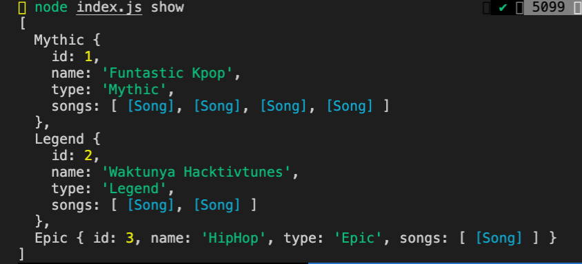
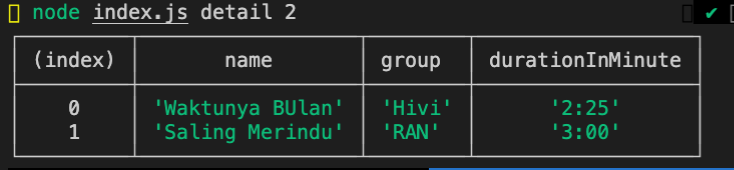
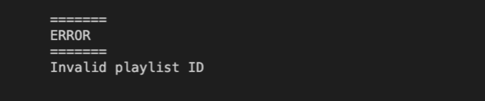
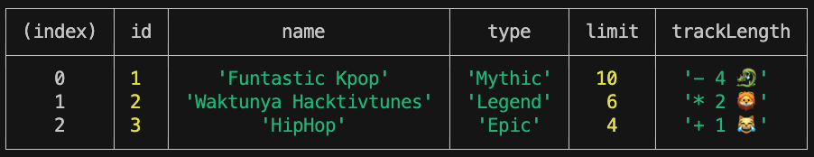
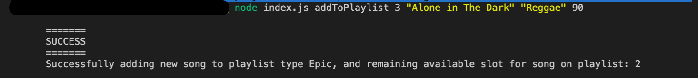
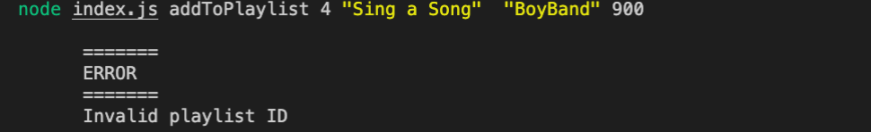

[](https://classroom.github.com/online_ide?assignment_repo_id=12298284&assignment_repo_type=AssignmentRepo)
# Hacktiv Tunes

> ⏰ Time Estimation ~120 minutes

## Summary

Kalian diminta untuk membuat aplikasi bernama `Hacktiv Tunes` yang akan menampilkan `Playlist` yang merupakan kumpulan `lagu` yang disukai oleh user.
> Kerjakan Live Code ini didalam folder `hacktiv-tunes` yang sudah disediakan dengan template MVC.

## Release 0 (34 Point)

Buatlah sebuah class `Playlist` yang memiliki property:

| property | description                                                 |
| -------- | ----------------------------------------------------------- |
| id       | `id` dari sebuah `Playlist`                                 |
| name     | `name` dari sebuah `Playlist`                               |
| type     | `type` dari sebuah `Song`                                   |
| songs    | Kumpulan instance dari class `Song`                         |
| limit    | `limit` `Song` yang bisa ditambahkan pada sebuah `Playlist` |

Dimana class `Song` memiliki property:

| property | description                                                    |
| -------- | -------------------------------------------------------------- |
| name     | `name` dari sebuah `Song`                                      |
| group    | `group` yang menyanyikan sebuah `Song`                         |
| duration | `duration` dari sebuah `Song` yang dibuat dalam hitungan detik |

> **Note & Hint :**
> - Property **limit** merupakan property yang menentukan jumlah maksimal `Song` yang bisa ditambah pada Playlist.
> - Buatlah property ini menjadi private dan buatlah getter & setter apabila dibutuhkan. 

Terdapat tiga type `Playlist` yang bisa didaftarkan yaitu:

- Mythic : Memiliki `limit` 10 `Song` yang dapat ditampung. 

- Legend : Memiliki `limit` 6 `Song` yang dapat ditampung

- Epic : Memiliki `limit` 4 `Song` yang dapat ditampung

Buatlah class class yang diperlukan sesuai dengan requirement diatas.


## Release 1 (23 Point)

`FORMAT DATA PADA "data.json" TIDAK BOLEH DIUBAH.`

Buatlah sebuah controller yang memiliki fitur:

1.  Buatlah fitur untuk menampilkan seluruh `Playlist` bersamaan dengan `Song` yang terdapat pada `Playlist` tersebut berdasarkan data yang ada pada file `data.json`.

> Rules : HARUS menggunakan **Factory Method** untuk menghasilkan instance dari child Playlist.

  - Command yang dijalankan
      ```bash
        $ node index.js show
      ```

  - Output yang diharapkan

      

## Release 2 (14 Point)

Buatlah sebuah fitur `detail` yang akan menampilkan list `Song` yang terdapat pada sebuah `Playlist`

Tambahkan sebuah **getter atau instance method** dengan nama `durationInMinute` yang akan menampilkan `duration` dari sebuah `song` dalam format menit:
  contoh:
  ```txt
    duration = 300
    durationInMinute = 5:00
    =====
    duration = 150
    durationInMinute = 2:30
  ```
  _diperbolehkan untuk mencari perhitungan konversi detik ke menit di google_

> **Rules :**
>  - HARUS menggunakan **Getter / Instance Method** untuk mengimplementasikan fitur ini.
>  - Tidak boleh menambahkan property baru pada instance (output dari Model)
>  - Buatlah logic pada View untuk mengatur tampilan sesuai pada table.

- Format command yang harus dijalankan
  ```bash
    $ node index.js detail <id>
  ```
- Expected output

  

- Dapat mengguanakan `console.table()` untuk mendapatkan format sesuai dengan ekspektasi.

- Lakukan validasi terhadap `id` yang diminta. Jika tidak ada  tampilkan pesan error.

  

## Release 3 (13 Point)

Buatlah sebuah fitur untuk menampilkan seluruh playlist dengan jumlah lagu yang terdapat didalamnya.\
Buatlah **instance method / getter** `trackLength` pada masing-masing class yang membutuhkan.\
Instance method/getter ini akan memperhitungkan `total Songs` dari `Playlist` dengan format output `<symbol1> <total Song> <symbol2>`
 - default Playlist : `[total song]` 
 - Mythic : `- [total song] 🐉`   
 - Legend : `* [total song] 🦁`
 - Epic : `+ [total song] 😹` 

>**Rules** :
>  - HARUS menggunakan Konsep **Polymorphism** untuk mengimplementasikan fitur ini.
>  - Tidak boleh menambahkan property baru pada instance (output dari Model)
>  - Property `songs` pada playlist tidak boleh ditampilkan pada table output.
>  - Buatlah logic pada View untuk mengatur tampilan sesuai pada table output.


- Format command yang harus dijalankan
  ```bash
    $ node index.js trackLength
  ```

- Output yang diharapkan (tidak terdapat porperty `songs` dan terdapat `trackLength`)

  


## Release 4 (16 Point)

Buatlah sebuah fitur yang dapat menambahkan sebuah `Song` kepada `Playlist` yang sudah ada.

- Format command yang harus dilakukan untuk menambahkan `Song` baru ke sebuah `Playlist` adalah

  ```bash
  $ node index.js addToPlaylist <idPlaylist> <songName> <songGroup> <songDuration>
  ```

- Contoh penggunaan command ini

  ```bash
   $ node index.js addToPlaylist 3 "Alone in The Dark" "Reggae" 90
  ```

  - Output yang diharapkan

    

Terdapat validasi yang harus dipenuhi untuk menambahkan `Song` baru


1. Pastikan `id` dari `Playlist` tersebut benar benar ada di dalam `data.json`

   - Output ketika error terjadi

     


  
