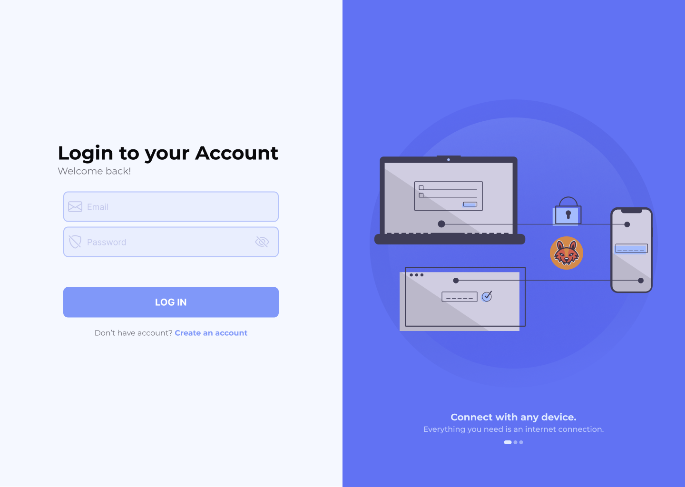
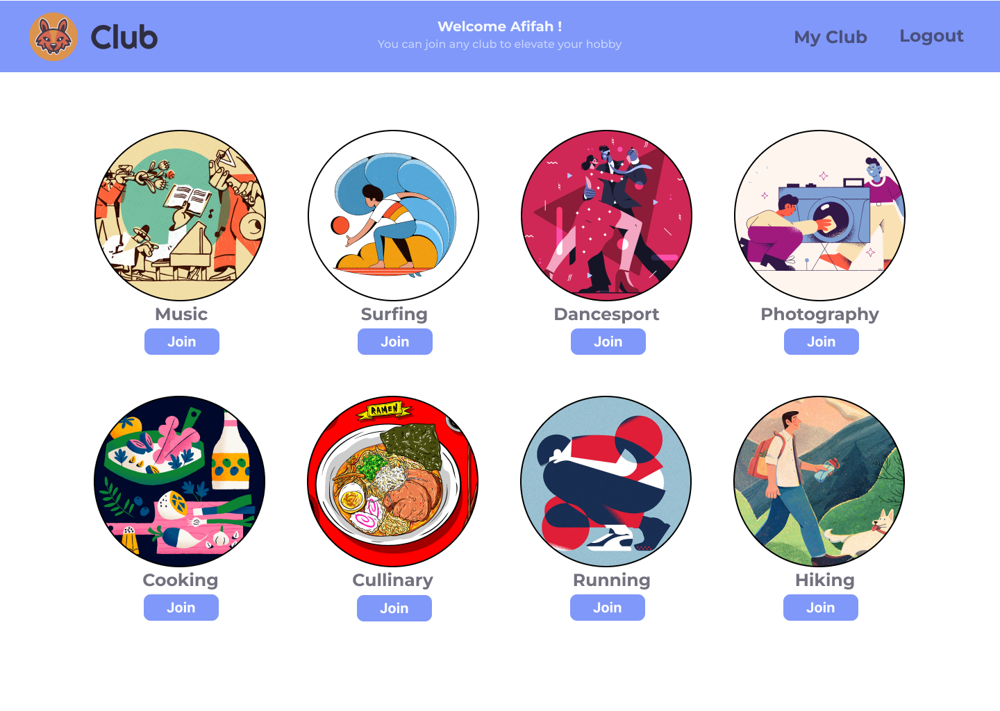
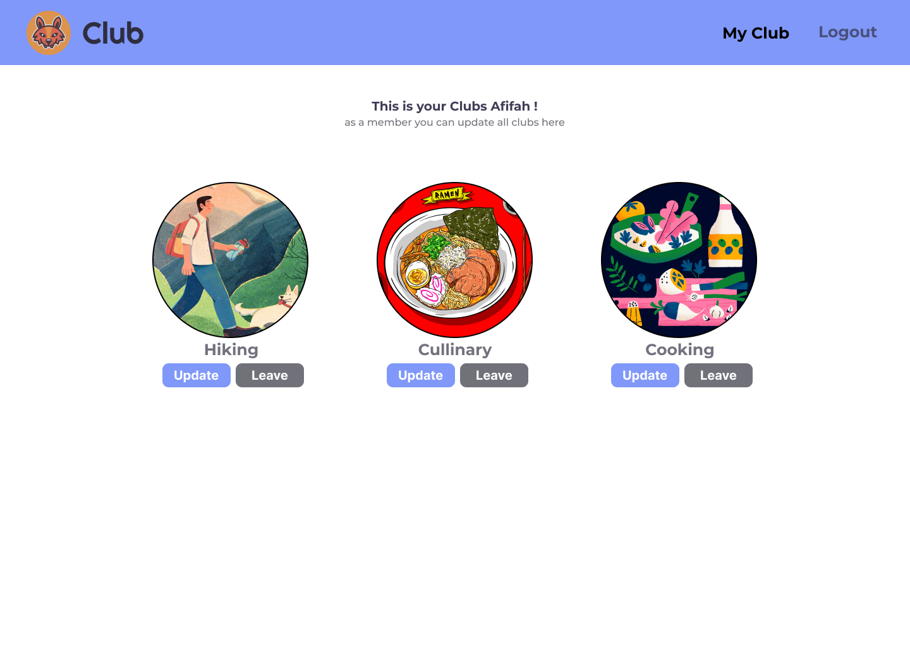
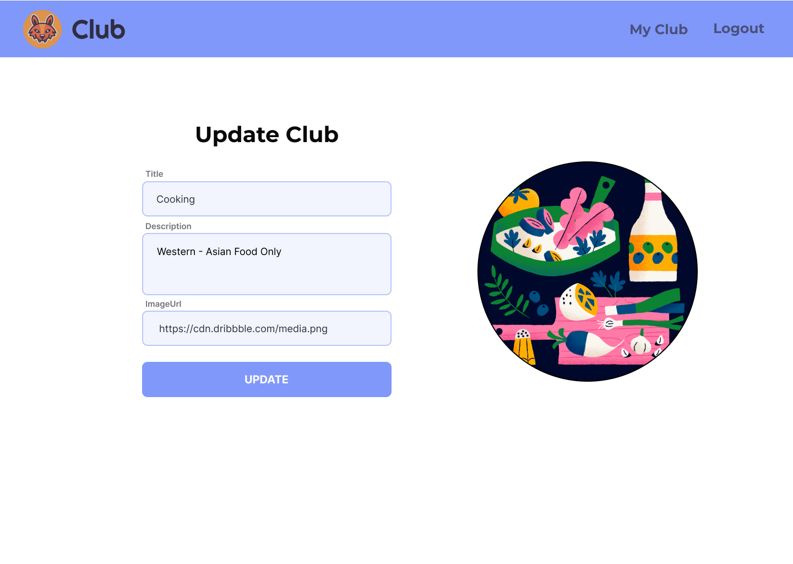

# FSJSP2S5-LC02 - Hacktiv Club

## Ringkasan

Kali ini, Kalian sedang menjadi seorang frontend dan ditugaskan untuk membuat aplikasi client-side bernama `Hacktiv Club`, sebuah aplikasi untuk membantu menampilkan list club favorite kalian. Feature utama dari aplikasi ini adalah:

1. User dapat melakukan register
2. User dapat melakukan login
3. User yang telah login dapat `melihat seluruh data club`
4. User dapat `Join` atau bergabung menjadi member club  
5. User yang sudah join atau menjadi member sebuah club dapat melakukan `update` terhadap club tersebut
6. User yang sudah join atau menjadi member sebuah club dapat melakukan `leave` terhadap club tersebut

Dalam tugas ini, Tim Backend kalian sudah menyediakan deployed API Server yang dapat kalian consume, dokumentasi server dapat dilihat pada file `api_docs.md`. Silahkan kalian buat semua feature sesuai release yang ada pada `README.md` ini!

Semoga sukses!

## Aturan & Kebijakan

- Waktu Pengerjaan: **180 min**
- (-10) jika `node_modules` tidak diignore
- (-5) jika `package.json` tidak ada, tidak valid atau tidak dipush
- (-5) jika tidak menyertakan example value `.env` bagi yang menggunakan dotenv
- (-2) jika menggunakan `alert` bawaan browser
- (-5) jika tidak menerapkan konsep SPA
- (-5) Error tidak ditampilkan pada client

## Deployed server

- url : <https://api.p2.lc2s5.foxhub.space/>
- Silahkan lakukan register user pada client dengan email yg belum terdaftar (boleh menggunakan postman terlebih dahulu)

## Components

Buatlah client side kalian yang terdiri dari beberapa component-component berikut:

- Register Page
- Login Page
- Home Page
  - Club Card
- MyClub Page
  - MyClub Card (optional)
- Club Update Page

## Release 0 - Setup Project

Lakukan setup project dengan menginstall package yang sudah diajarkan sebelumnya yaitu vite, react.js dan react-router. Pada project ini terdapat `api_docs.md` dan assets sebagai referensi tampilan web yang diharapkan. Kalian boleh menggunakan framework CSS favorite kalian pada project ini

Catatan:
Tampilan Client Side pada assets hanya sebagai referensi atau contoh tampilan, kalian boleh menyesuaikan tampilan ASALKAN layout atau tata letak komponen sama dengan assets yang sudah diberikan. Kalian boleh fokus untuk menyelesaikan feature dahulu lalu akhiri dengan tampilan yang rapi dan menarik.

## Release 1 - Authentication: Register

- Buatlah route `/register` untuk menampilkan form register user seperti pada gambar berikut
- Jika proses register berhasil maka akan pindah ke halaman login
- tampilkan pesan error dari server jika terjadi kegagalan dalam melakukan register

## Release 2 - Authentication: Login

- Buatlah route `/login` untuk menampilkan form login user seperti pada gambar berikut
- Jika proses login berhasil maka akan menampilkan semua club yang ada dari server
- Pastikan ketika user sudah berhasil login, ketika direfresh maka user tidak harus login lagi

## Release 3 - Home Page (Fetch Clubs)

- Buatlah route `/` untuk menampilkan list club di client dari data `api_doc.md` yang disediakan
- Buatlah Card untuk menampilkan detail dari Club dan tambahkan tombol `Join` pada setiap Card club yang ada
- Terapkan konsep component untuk setiap bagian yang bersifat `reuseable`

## Release 4 - Fetch My Clubs

- Buatlah route `/my-clubs` untuk menampilkan list club yang sudah dipilih oleh user yang sedang login di client dari data `api_doc.md` yang disediakan
- Buatlah Card untuk menampilkan list dari MyClub dan tambahkan tombol `Update` & `Leave` pada setiap Card club yang ada
- Terapkan konsep component untuk setiap bagian yang bersifat `reuseable`

## Release 5 - Join Club

- Pada halaman Home, Integrasi tombol `Join` di card club sehingga dapat menambahkan club ke daftar club user yang sedang login
- Jika berhasil maka user akan diarahkan ke Halaman List MyClubs
- Jika berhasil join club maka list my club akan bertambah otomatis di client (Pastikan website kalian reaktif)
- Lakukan validasi untuk club yang duplikat

## Release 6 - Leave Club

- Pada halaman My Clubs, Integrasi tombol `Leave` pada list my club
- Jika berhasil leave club maka list my club user akan berkurang tanpa harus di refresh (Pastikan website kalian reaktif)

## Release 7 - Update Club

- Buatlah route `/update-club` untuk menampilkan form update club di client
- Integrasi tombol `Update` pada list my club ke Halaman Update Club
- Jika Berhasil melakukan Update Club user akan diredirect ke halaman Home `/`
- Jika berhasil update club maka list Club akan berubah sesuai dengan data yang diupdate tanpa harus di refresh (Pastikan website kalian reaktif)

## Release 8 - Authentication: Logout

- Buatlah tombol logout dan ketika proses logout berhasil maka akan kembali ke tampilan login
- Pastikan ketika user sudah berhasil logout, ketika direfresh maka user akan ke tampilan login
